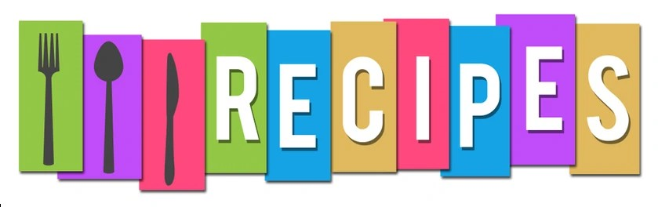

# Recipe Website

A simple recipe website built with HTML and CSS. The website showcases recipes with ingredients, preparation steps, and images.

## Features

- Recipe images
- Ingredients list
- Step-by-step instructions


## Technologies Used

- HTML5
- CSS


## Installation

1. Clone the repository:

```bash
git clone <repository-url>
```

2. Open the project folder.

3. Launch `index.html` in your browser.

## Usage

Browse the recipes and follow the instructions provided for each dish.


## Image Credits

The images used in this project belong to their respective owners.

| Image | Source |
|---------|---------|
## Image Credits

- Baked Potato image by Yolanda Djajakesukma on Unsplash:
  https://unsplash.com/photos/a-baked-potato-covered-in-cheese-and-broccoli-ZarbohKJIQ8

- Pancake image by Fernando Andrade on Unsplash:
  https://unsplash.com/photos/pancake-with-honey-and-honey-dipper-ZQKY56UdcSQ


- Pasta image by AlexPro9500 on istockphoto:
  https://www.istockphoto.com/photo/portion-of-lasagne-on-white-plate-gm1432300442-474600036


Images are used for educational and non-commercial purposes.

## Author

Johannes Malefetsane 

## License

This project is for educational purposes.
